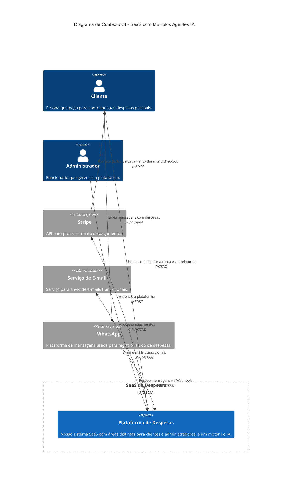
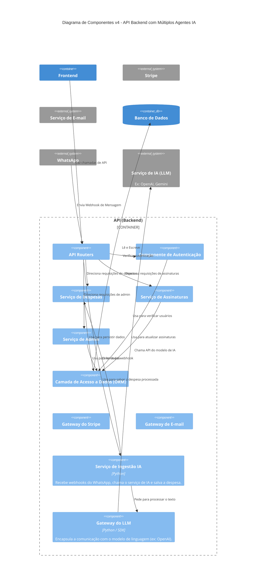

# Plano de Projeto: SaaS de Controle de Despesas Pessoais v4.0

**Data da Última Revisão:** 1 de Setembro de 2025
**Status:** Visão Estratégica e de Longo Prazo Aprovada

## Sumário Executivo

Este documento detalha o plano de desenvolvimento para um software como serviço (SaaS) de controle de despesas pessoais. A solução visa atender a uma lacuna no mercado brasileiro para usuários que buscam simplicidade e facilidade de uso.

O sistema será composto por duas áreas principais:
1.  **Área do Cliente:** Focada no registro intuitivo de despesas.
2.  **Área Administrativa:** Para a gestão completa da plataforma.

O modelo de negócio será de assinatura mensal, validado desde o MVP. A visão de longo prazo é criar um verdadeiro assistente financeiro pessoal através da introdução de múltiplos **agentes de Inteligência Artificial**, que automatizam e geram insights sobre as finanças do usuário, justificando um ecossistema de planos com diferentes níveis de valor.

- **Stack Tecnológica:** FastAPI (Python), Angular, PrimeNG/TailwindCSS, PostgreSQL, Docker.
- **Infraestrutura:** Vercel (Frontend) e Render (Backend/DB).
- **Tecnologias Futuras:** WhatsApp Business API, Modelos de NLP/LLM (ex: OpenAI API, Gemini API), Serviços de OCR.

---

## 1. Estratégia e Filosofia de Desenvolvimento

- **MVP Comercial:** Validar o produto e o modelo de negócio simultaneamente.
- **Controle de Acesso Baseado em Função (RBAC):** Arquitetura com clara separação entre "Cliente" e "Administrador".
- **Desenvolvimento Ágil e Segurança por Padrão:** Ciclos curtos de desenvolvimento e segurança como pilar inegociável.

---

## 2. Arquitetura da Solução (Modelo C4)

A arquitetura já contempla a futura integração com múltiplos serviços de IA.

### Nível 1: Diagrama de Contexto do Sistema

*Visão macro do sistema, seus usuários e as interações com sistemas externos.*

### Nível 2: Diagrama de Contêineres

*Zoom no sistema, mostrando seus principais blocos de construção (Frontend, Backend, DB).*

### Nível 3: Diagrama de Componentes do Backend

*Detalha a estrutura interna da API Backend, preparada para os múltiplos agentes de IA.*

---

## 3. Modelo de Dados (Visão Geral)

A persistência dos dados será feita em um banco de dados relacional (PostgreSQL). As principais entidades do sistema são:

-   **Usuário (User):** Armazena informações de login, perfil, **função (role)** (Cliente/Admin), status da assinatura e o número de WhatsApp associado (para o plano IA).
-   **Despesa (Expense):** Contém os detalhes de cada transação (valor, descrição, data). Associada a um usuário e a uma categoria.
-   **Categoria (Category):** Define as categorias de gastos. Se a associação com o usuário for nula (`user_id = NULL`), a categoria é considerada **Global**. Caso contrário, é uma categoria pessoal.

*Nota: O schema detalhado do banco de dados será mantido em um documento técnico separado.*

---

## 4. Modelo de Planos e Monetização

A estratégia de monetização evoluirá com o produto, oferecendo diferentes níveis de valor.

- **Plano Básico (Pago):**
  - Acesso a todas as funcionalidades manuais do aplicativo (CRUD de despesas, relatórios, etc.).
  - Inclui o **Agente "Categorizador Inteligente"** como um diferencial para acelerar o registro manual.

- **Plano IA / Premium (Pago, valor superior):**
  - Todos os benefícios do Plano Básico.
  - Acesso ao ecossistema de agentes de IA:
    - Registro de Despesas via **WhatsApp**.
    - **Detetive de Insights** (notificações proativas).
    - **Caçador de Assinaturas** (identificação de gastos recorrentes).
    - **Scanner de Recibos** (OCR de notas fiscais).

---

## 5. Roadmap de Desenvolvimento

### CICLO 1: FUNDAÇÃO E LANÇAMENTO COMERCIAL

#### Fase 0: Fundação (Duração: ~1 Semana)
-   **Objetivo:** Preparar todo o ambiente de desenvolvimento e infraestrutura.

#### Fase 1: MVP - Lançamento Comercial (Duração: 3-4 Meses)
-   **Objetivo:** Lançar a primeira versão pública, funcional e capaz de gerar receita.
-   **Módulos:** Cliente (CRUDs), Assinaturas (Stripe) e Administrador (Gestão).

#### Fase 2: Primeiras Melhorias (Pós-Lançamento) (Duração: ~2 Meses)
-   **Objetivo:** Adicionar funcionalidades de alto valor com base no feedback inicial.
-   **Tarefas:** Gráficos, Despesas Recorrentes, Filtros/Busca, Recuperação de Senha.

#### Fase 3: Amadurecimento do Produto (Duração: ~3 Meses)
-   **Objetivo:** Aumentar a retenção de usuários com funcionalidades avançadas.
-   **Tarefas:** Metas de Orçamento, Relatórios (PDF/CSV), Múltiplas "Carteiras", Tema Escuro.

---

### CICLO 2: EXPANSÃO COM INTELIGÊNCIA ARTIFICIAL

#### Fase 4: Inovação com IA e Conveniência (Desenvolvimento Contínuo)
-   **Objetivo:** Introduzir um diferencial competitivo único, justificar o plano de assinatura premium e aumentar drasticamente a conveniência para o usuário.
-   **Módulo 4.1: Registro via WhatsApp:**
    -   [ ] Criar o **Plano IA / Premium** no sistema e no Stripe.
    -   [ ] Implementar fluxo de configuração e validação do número de WhatsApp do cliente.
    -   [ ] Desenvolver o serviço de backend para receber webhooks do WhatsApp.
    -   [ ] Integrar com um serviço de LLM para processar o texto das mensagens.
    -   [ ] Implementar a lógica para salvar a despesa extraída na conta do usuário correto.
    -   [ ] Implementar mensagens de confirmação de volta para o usuário via WhatsApp.
-   **Módulo 4.2: Categorização Inteligente (Melhoria do Plano Básico):**
    -   [ ] Implementar a sugestão automática de categorias com base na descrição da despesa no formulário principal.
-   **Módulo 4.3: Detetive de Insights e Caçador de Assinaturas (Plano IA):**
    -   [ ] Desenvolver rotinas de análise de dados que rodam em segundo plano.
    -   [ ] Implementar a lógica para detectar anomalias, tendências e pagamentos recorrentes.
    -   [ ] Criar um sistema de notificações para apresentar esses insights aos usuários premium.
-   **Módulo 4.4: Scanner de Recibos (Plano IA):**
    -   [ ] Integrar um serviço de OCR.
    -   [ ] Desenvolver a funcionalidade na interface para que o usuário possa tirar uma foto do recibo.
    -   [ ] Implementar a lógica para extrair os dados e preencher o formulário de despesa.
