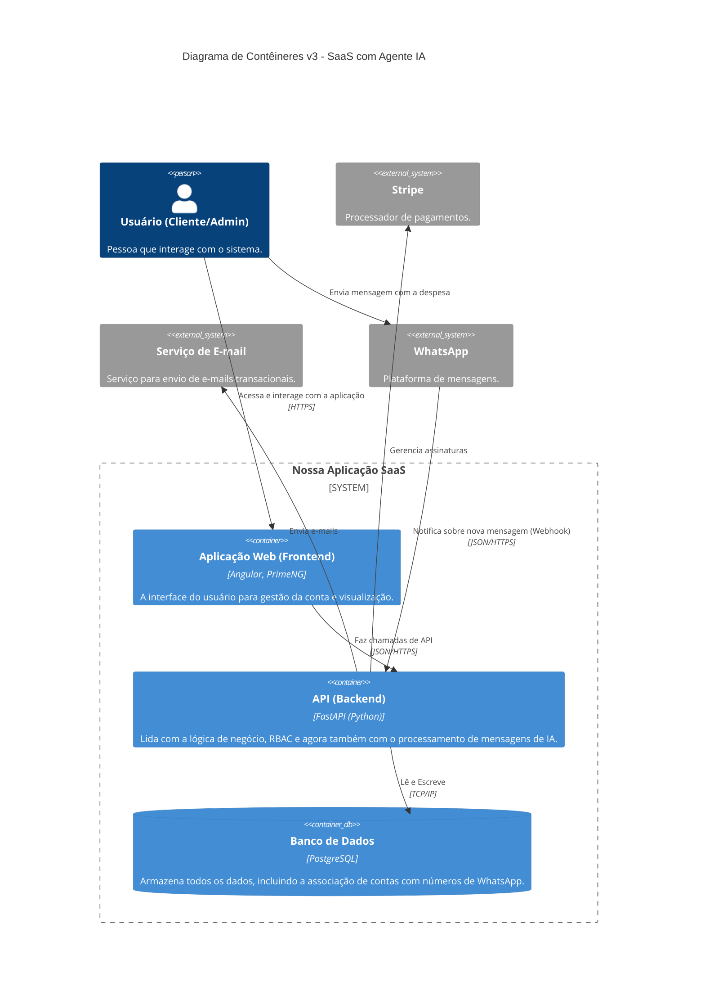
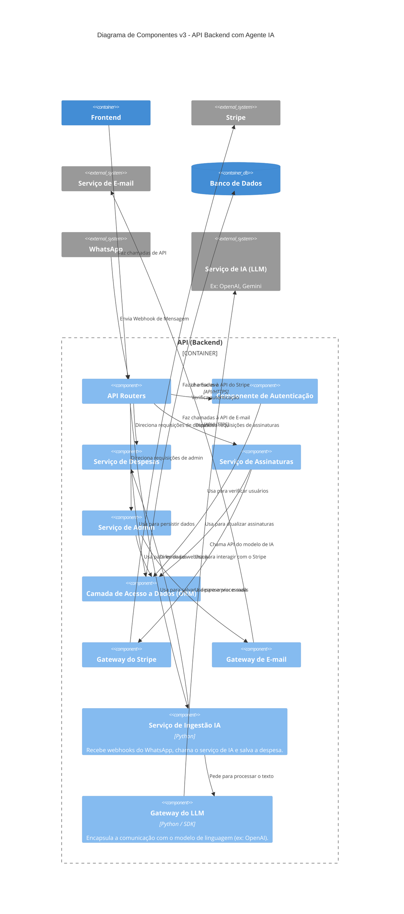

# Plano de Projeto: SaaS de Controle de Despesas Pessoais v3.2

**Data da Última Revisão:** 1 de Setembro de 2025
**Status:** Visão Estratégica Aprovada

## Sumário Executivo

Este documento detalha o plano de desenvolvimento para um software como serviço (SaaS) de controle de despesas pessoais. A solução visa atender a uma lacuna no mercado brasileiro para usuários que buscam simplicidade e facilidade de uso.

O sistema será composto por duas áreas principais:
1.  **Área do Cliente:** Focada no registro intuitivo de despesas.
2.  **Área Administrativa:** Para a gestão completa da plataforma, clientes e pagamentos.

O modelo de negócio será de assinatura mensal, validado desde o MVP com um período de teste de 14 dias. A visão de longo prazo inclui um **plano premium com um Agente de IA**, que permitirá o registro de despesas via WhatsApp.

- **Stack Tecnológica:** FastAPI (Python), Angular, PrimeNG/TailwindCSS, PostgreSQL, Docker.
- **Infraestrutura:** Vercel (Frontend) e Render (Backend/DB).
- **Tecnologias Futuras:** WhatsApp Business API, Modelos de NLP/LLM (ex: OpenAI API, Gemini API).

---

## 1. Estratégia e Filosofia de Desenvolvimento

- **MVP Comercial:** O foco do Mínimo Produto Viável é validar o produto e o modelo de negócio simultaneamente.
- **Controle de Acesso Baseado em Função (RBAC):** A arquitetura será construída sobre uma clara separação entre as funções de "Cliente" e "Administrador".
- **Desenvolvimento Ágil e Segurança por Padrão:** Ciclos curtos de desenvolvimento e segurança como pilar inegociável do projeto.

---

## 2. Arquitetura da Solução (Modelo C4)

A arquitetura é documentada em três níveis de abstração para garantir clareza.

### Nível 1: Diagrama de Contexto do Sistema

*Visão macro do sistema, seus usuários e as interações com sistemas externos.*

### Nível 2: Diagrama de Contêineres

*Zoom no sistema, mostrando seus principais blocos de construção (Frontend, Backend, DB).*

### Nível 3: Diagrama de Componentes do Backend

*Detalha a estrutura interna da API Backend e seus principais módulos.*

---

## 3. Modelo de Dados (Visão Geral)

A persistência dos dados será feita em um banco de dados relacional (PostgreSQL). As principais entidades do sistema são:

-   **Usuário (User):** Armazena informações de login, perfil, **função (role)** (Cliente/Admin), status da assinatura e o número de WhatsApp associado (para o plano IA).
-   **Despesa (Expense):** Contém os detalhes de cada transação (valor, descrição, data). Associada a um usuário e a uma categoria.
-   **Categoria (Category):** Define as categorias de gastos. Se a associação com o usuário for nula (`user_id = NULL`), a categoria é considerada **Global** e disponível para todos. Caso contrário, é uma categoria pessoal.

*Nota: O schema detalhado do banco de dados será mantido em um documento técnico separado.*

---

## 4. Roadmap de Desenvolvimento

### Fase 0: Fundação (Duração: ~1 Semana)
-   **Objetivo:** Preparar todo o ambiente de desenvolvimento e infraestrutura.
-   **Tarefas:** Criar repositório Git; Iniciar projetos Angular e FastAPI; Configurar Docker e CI/CD básico; Criar contas nos serviços de nuvem.

### Fase 1: MVP - Lançamento Comercial (Duração: 3-4 Meses)
-   **Objetivo:** Lançar a primeira versão pública, funcional e capaz de gerar receita.
-   **Módulo do Cliente:**
    -   [ ] Autenticação (Cadastro, Login, Logout).
    -   [ ] CRUD de categorias pessoais.
    -   [ ] CRUD de despesas.
    -   [ ] Dashboard com total de gastos do mês.
-   **Módulo de Assinaturas:**
    -   [ ] Integração completa com Stripe (Checkout e Webhooks).
    -   [ ] Lógica de trial de 14 dias.
    -   [ ] Acesso ao Portal do Cliente Stripe para autogestão.
-   **Módulo do Administrador:**
    -   [ ] Autenticação segura baseada em `role`.
    -   [ ] Dashboard com métricas chave.
    -   [ ] Visualização de lista de clientes e status.
    -   [ ] CRUD de categorias globais.

### Fase 2: Primeiras Melhorias (Pós-Lançamento) (Duração: ~2 Meses)
-   **Objetivo:** Adicionar funcionalidades de alto valor com base no feedback inicial.
-   **Tarefas:** Melhorias no Dashboard do Cliente (gráficos); Cadastro de Despesas Recorrentes; Filtros e Busca de despesas; Fluxo de Recuperação de Senha; Melhorias no Painel Admin.

### Fase 3: Amadurecimento do Produto (Duração: ~3 Meses)
-   **Objetivo:** Aumentar a retenção de usuários com funcionalidades avançadas.
-   **Tarefas:** Metas de Orçamento; Relatórios (PDF/CSV); Múltiplas "Carteiras"; Tema Escuro (Dark Mode).

### Fase 4: Inovação com IA (Segundo Ciclo de Desenvolvimento)
-   **Objetivo:** Introduzir um diferencial competitivo único e justificar um novo plano de assinatura de maior valor.
-   **Modelo de Negócio:**
    -   [ ] Criar um novo plano de assinatura ("Plano IA") com preço superior.
    -   [ ] Atualizar a UI para refletir os diferentes planos.
-   **Checklist de Features:**
    -   [ ] Implementar fluxo de configuração e validação do número de WhatsApp do cliente.
    -   [ ] Desenvolver o serviço de backend para receber webhooks do WhatsApp.
    -   [ ] Integrar com um serviço de LLM para processar o texto das mensagens.
    -   [ ] Implementar a lógica para salvar a despesa extraída na conta do usuário correto.
    -   [ ] Implementar mensagens de confirmação de volta para o usuário via WhatsApp.
